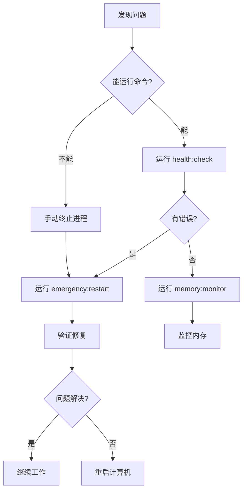

# 🚨 紧急情况快速参考

> 当 Claude Code 挂死或出现内存问题时，请按以下步骤操作

---

## ⚡ 立即行动

### 第一步：诊断问题

```bash
# 快速健康检查
npm run health:check
```

### 第二步：紧急清理

```bash
# 清理所有进程和缓存
npm run emergency:restart
```

### 第三步：验证恢复

```bash
# 检查系统状态
npm run health:check

# 启动内存监控（可选）
npm run memory:monitor
```

---

## 🩺 常见症状与解决方案

| 症状 | 原因 | 解决方案 |
|------|------|----------|
| Claude Code 响应极慢 | 内存溢出前兆 | `npm run memory:monitor` |
| Claude Code 完全挂死 | 进程已崩溃 | `npm run emergency:restart` |
| 端口被占用错误 | 进程未正常退出 | `npm run cleanup:processes` |
| 构建失败 | 内存不足 | `npm run cleanup:cache` |
| 奇怪的行为 | 缓存污染 | `npm run cleanup:all` |

---

## 📞 故障排除流程



---

## 🎯 预防措施

### 开发期间

- [ ] 每 2-3 小时重启开发服务器
- [ ] 定期运行 `npm run health:check`
- [ ] 避免同时修改大量文件
- [ ] 使用 `npm run memory:monitor` 监控

### Claude Code 使用

- [ ] 避免并发大操作
- [ ] 完成功能立即提交
- [ ] 分阶段执行重构
- [ ] 注意响应时间变化

---

## 📱 快捷命令

```bash
# 监控内存（实时）
npm run memory:monitor

# 健康检查
npm run health:check

# 紧急重启
npm run emergency:restart

# 清理进程
npm run cleanup:processes

# 清理缓存
npm run cleanup:cache

# 完全清理
npm run cleanup:all
```

---

## 🔍 内存使用基准

| 状态 | 堆内存 | 系统内存 | 行动 |
|------|--------|----------|------|
| 🟢 正常 | < 70% | < 75% | 继续工作 |
| 🟡 警告 | 70-85% | 75-90% | 准备重启 |
| 🔴 危险 | > 85% | > 90% | 立即重启 |

---

## 🆘 救命命令（当其他都失败时）

### Windows

```powershell
# 强制终止所有 Node.js 进程
taskkill /F /IM node.exe

# 清理缓存
Remove-Item -Recurse -Force app\node_modules\.cache
Remove-Item -Recurse -Force **\.vite

# 清理 npm 缓存
npm cache clean --force

# 重启
npm run dev
```

### Unix/Linux/Mac

```bash
# 强制终止所有 Node.js 进程
killall -9 node

# 清理缓存
rm -rf app/node_modules/.cache **/.vite

# 清理 npm 缓存
npm cache clean --force

# 重启
npm run dev
```

---

## 📞 需要更多帮助？

- 📖 详细文档: [CLAUDE_CODE_STABILITY_GUIDE.md](./CLAUDE_CODE_STABILITY_GUIDE.md)
- 🛠️ 工具指南: [SCRIPTS_TOOLS_GUIDE.md](./SCRIPTS_TOOLS_GUIDE.md)
- 📋 项目 README: [../../README.md](../../README.md)

---

## ✅ 恢复检查清单

完成紧急重启后，检查以下项目：

- [ ] 开发服务器正常启动
- [ ] 端口 5173 和 3001 可访问
- [ ] 浏览器可以加载应用
- [ ] Claude Code 响应正常
- [ ] 内存使用在正常范围内
- [ ] 未编译的错误或警告

---

**记住**: 预防胜于治疗。定期监控和维护可以避免大多数问题。

**最后更新**: 2026-03-04
**状态**: ✅ 可用
